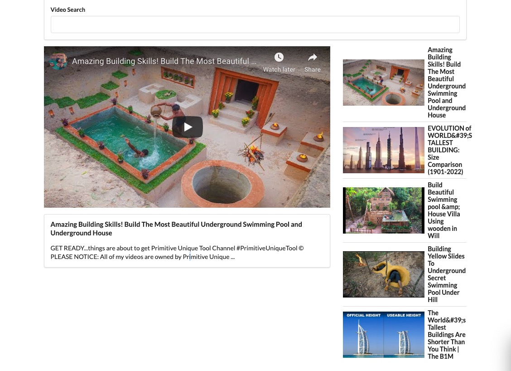

# videosApp

A youtube similar browser application which allows users to type the search terms on the input box, view the list of results, and click to play in the embedded player. The application focused on React and CSS. It integrates axios, youtube public free API, and semantic ui css library.



Heroku Link: https://videos-react-app.herokuapp.com/

## Getting Started
### Prerequisites

What things you need to install the software:

* [React] 


### Installation

First, download and install React - https://reactjs.org/

After you have successfully installed the React library. Download this project and change to the project directory.
```sh
$ cd videosReactApp
```

Install packages that are required for this project.

```sh
$ npm install --save node_modules axios
```

Start the project

```sh
$ npm start
```

Note: You might interact with errors for missing packages if this is the first time starting this project. Follow the terminal error instruction to install other neccessary packages. 

React should automatically pop the web browser open with the project running on localhost:3000. If not, simply open your browser and search localhost:3000 to access this project. 
